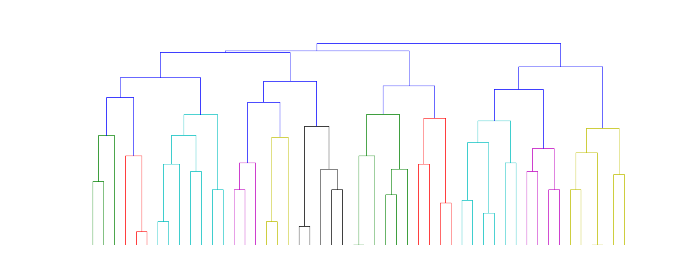

# Paris algorithm

Paris is a hierarchical graph clustering algorithm described in the paper:

[Hierarchical Graph Clustering using Node Pair Sampling](http://arxiv.org/abs/1806.01664)

by Thomas Bonald, Bertrand Charpentier, Alexis Galland and Alexandre Hollocou

## Dependency

This Python module depends on the `networkx` package,
which can be installed using `pip`.

```python
sudo pip install networkx
```

## Getting started

Hierarchical clustering of a simple graph

```python
import networkx as nx
from paris import paris
```

Generate a simple network:

```python
G = nx.erdos_renyi_graph(n = 50, p = 0.2)
```

Compute the hierarchical clustering (as a dendrogram):

```python
D = paris(G)
```

Visualize the dendrogram:

```python
from utils import plot_dendrogram

plot_dendrogram(D)
```



## Running the tests

Tests on both synthetic and real data are available as a Jupyter notebook:

```python
hierarchical_clustering.ipynb
```
  
## License


Released under the 3-clause BSD license.

