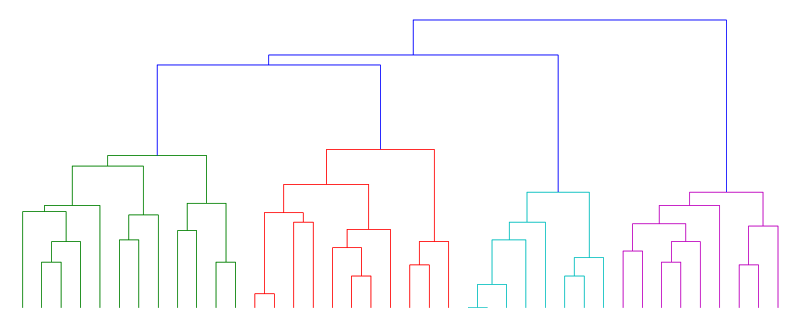

# Paris algorithm

Paris is a hierarchical graph clustering algorithm described in the paper:

[A Sliding-Resolution Algorithm for Hierarchical Graph Clustering](https://perso.telecom-paristech.fr/bonald/papers/paris.pdf)

by Thomas Bonald, Bertrand Charpentier, Alexis Galland and Alexandre Hollocou

## Dependency

This Python module depends on the `networkx` package,
which can be installed using `pip`.

```python
sudo pip install networkx
```

## Getting started

Hierarchical clustering of a simple graph

```python
from paris.experiments.synthetic_data import sbm
from paris.algorithms.paris import paris
```

Stochastic block model with 4 blocks of 10 nodes and internal / external average degrees = 6 / 1

```python
model = sbm(4 * [10], 6, 1)
```

Random instance of the model (as a `networkx` graph)

```python
G = model.generate_graph()
```
Hierarchical clustering (as a dendrogram)

```python
D = paris(G)
```

Visualization

```python
from paris.experiments.plot_tools import plot_dendrogram

plot_dendrogram(D)
```



Extraction of the top clustering(s) from the dendrogram


```python
from paris.algorithms.hierarchy import top_clustering, top_clusterings

nodes = list(G.nodes())
C = top_clustering(D, nodes)
print([len(c) for c in C])
```
[10, 10, 9, 11]

```python
C_list = top_clusterings(D, nodes, 3)
for C in C_list:
    print([len(c) for c in C])
```
[10, 10, 9, 11]
[4, 2, 4, 2, 5, 4, 4, 4, 5, 6]
[2, 4, 2, 4, 2, 5, 4, 4, 2, 4, 3, 4]

## Running the tests

Tests on both synthetic and real data are available as Jupyter notebooks:

```python
synthetic_data.ipynb
real_data.ipynb
```
  
## License


Released under the GNU General Public License v3.

